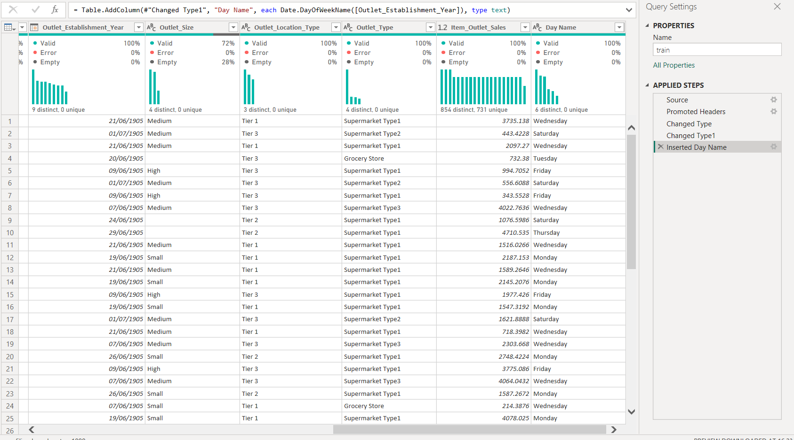

# Bigmart Sales Analysis 

## Introduction:

This is a Power Bi project on sales analysis of a supermarket called Bigmart. The dataset is used to predict sales for various products across different stores in different cities. The data includes attributes such as item identifiers, weights, fat content, visibility, and more.  

The project is to analyze and derive insights to answer crucial questions and help the supermarket make data driven decisions.

## Problem Statement:

- What are the properties of products that stores which play a key role in increasing sales
- What role certain items plays and how they affect sales
- hat is the total sales made daily

 ## Skill/Concepts:

 Power Bi concepts applied
Dax Concepts: Line charts, Donut charts, pie charts, stack bar.

## Data Sourcing:

The dataset was sourced from Kaggle. I then downloaded the Csv file, extracted it into Power Bi for cleaning analysis and visualization.

## Data Transformation/ Cleaning:

The data was efficiently cleaned and transformed with Power query editor of Power Bi. We used various data visualization techniques to understand the distribution of the data and identify patterns. A screenshot of the applied steps

Some of the steps applied includes:
- Making first row as headers
- Change type
- Created a new column called Day

## Analysis:

- Item_MRP: The price of the item has a significant positive correlation with sales, indicating that higher-priced items tend to sell more.
- Item_Weight: The weight of the item also has a positive correlation with sales, suggesting that heavier items tend to sell more.
- Item_Visibility: The visibility of the item, which could include factors like shelf placement and product placement, has a positive correlation with sales, indicating that more visible items tend to sell more.
- Outlet_Location_Type: The type of location where the store is situated, such as urban or rural, has a significant impact on sales. Urban locations tend to have higher sales compared to rural locations.
- Item_Type_Categories: The categories of items, such as beverages or snacks, also have a significant impact on sales. Beverages tend to sell more than snacks.

## Recommendations:

- Analyze the product attributes such as product weight, fat content, and visibility, and store attributes like outlet size and location to understand how these factors influence sales.
- Analyze sales by store location to identify which locations are performing better and why.
- Understand the sales patterns for different product categories to optimize inventory and pricing strategies.
- Analyze the correlation between different variables to identify relationships between product characteristics and sales.
